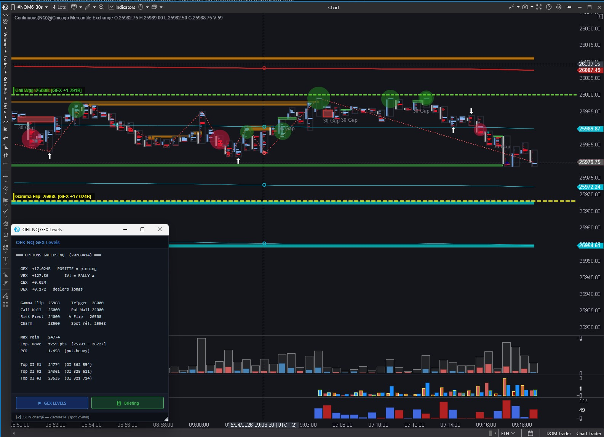
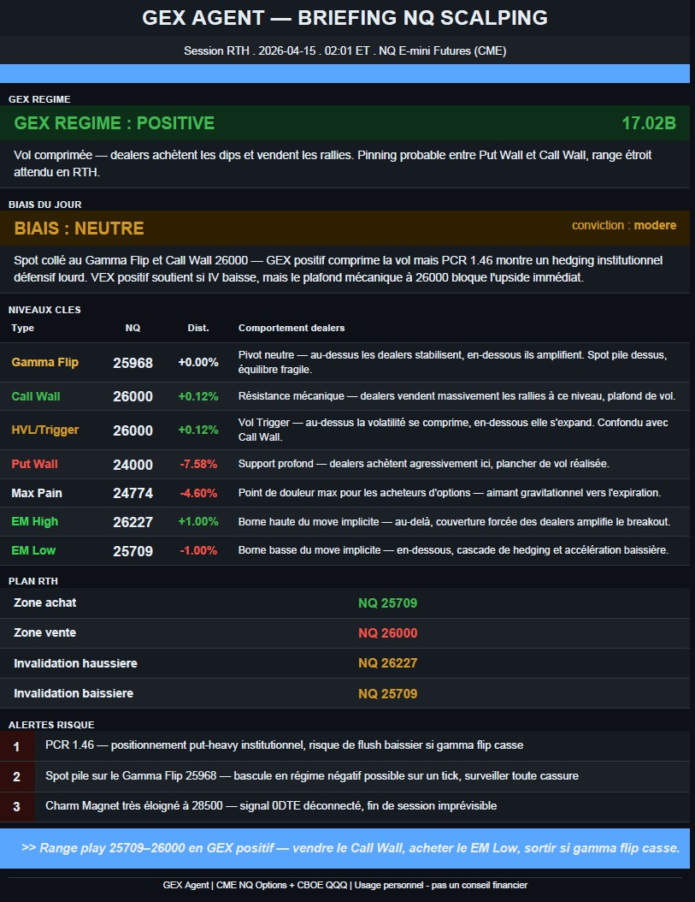

# OFK GEX Levels — NQ & ES

**Free ATAS indicators for NQ and ES E-mini futures traders — real options market structure on your chart.**

Combines live CME options data, CBOE options chain, and a Claude AI morning briefing into a single one-click workflow. Run it before RTH open to get all key gamma levels, Max Pain, Expected Move, top OI strikes, and a PDF trading plan — for both NQ and ES.

| NQ Chart | ES Chart |
|---|---|
|  |  |

| PDF Briefing NQ | PDF Briefing ES |
|---|---|
|  |  |

---

## What it shows

### On the chart (toggleable per level)

| Level | Source | Description |
|---|---|---|
| Gamma Flip [GEX] | CME | Zero-gamma line — dealers stabilize above, amplify below |
| Call Wall [GEX] | CME | Highest call gamma strike — mechanical resistance |
| Put Wall [GEX] | CME | Highest put gamma strike — mechanical support |
| Vol Trigger | CME | Volatility regime boundary |
| Risk Pivot | CME | Trapdoor — breakdown accelerates below |
| Vanna Flip | CME | IV-driven flow reversal level |
| Charm Magnet | CME | 0DTE end-of-session price magnet |
| Max Pain | CBOE | Strike minimizing total option holder losses |
| EM High / EM Low | CBOE | Expected Move range (±1σ) |
| Top OI #1 / #2 / #3 | CBOE | Highest open interest strikes |

### In the floating panel
- GEX / VEX / CEX / DEX totals and regimes
- PCR, Expected Move, Top OI strikes
- **▶ GEX LEVELS NQ** or **▶ GEX LEVELS** — runs the full morning pipeline
- **📄 Briefing** — opens today's PDF

---

## Requirements

- [ATAS platform](https://atas.net) (Classic or ATAS X Beta for macOS)
- Python 3.11+ (tested on 3.14)
- [Claude Code](https://claude.ai/code) installed and authenticated (Pro or Max plan)
- Windows (Playwright requires a visible Chromium — Akamai blocks headless)

---

## Installation

### 1. Clone the repo

```bash
git clone https://github.com/YOUR_USERNAME/OFK-GEX-Levels.git
```

### 2. Copy Python files

```powershell
mkdir C:\gex_agent
mkdir C:\gex_agent\data
mkdir C:\gex_agent\skills

copy python\*.py          C:\gex_agent\
copy python\skills\*.md   C:\gex_agent\skills\
copy CLAUDE.md            C:\gex_agent\
```

### 3. Install Python dependencies

```powershell
py -m pip install requests reportlab playwright
py -m playwright install chromium
```

### 4. Add the indicators to your ATAS project

```
csharp\OFK_NQ_GEX_Levels.cs   -> your ATAS project
csharp\OFK_ES_GEX_Levels.cs   -> your ATAS project
```

```powershell
dotnet build -c Release
```

### 5. Configure indicator settings in ATAS

#### NQ Indicator (group 09 — Floating Panel)
| Setting | Value |
|---|---|
| JSON Path | `C:\gex_agent\data\full_levels_NQ.json` |
| Python executable path | `C:\Python314\python.exe` |
| Script path | `C:\gex_agent\run_morning_NQ.py` |
| PDF briefing folder | `C:\gex_agent\data` |

#### ES Indicator (group 09 — Floating Panel)
| Setting | Value |
|---|---|
| JSON Path | `C:\gex_agent\data\full_levels_ES.json` |
| Python executable path | `C:\Python314\python.exe` |
| Script path | `C:\gex_agent\run_morning_ES.py` |
| PDF briefing folder | `C:\gex_agent\data` |

---

## Daily workflow

**Each morning before RTH open (recommended: 08:45 ET):**

1. Open your ATAS chart with the indicator loaded
2. Click **▶ GEX LEVELS NQ** (and/or **▶ GEX LEVELS** for ES)
3. A Chromium browser opens to fetch CME data (~30s)
4. Full pipeline runs: CME → CBOE → merge → Claude AI → PDF
5. Levels appear on the chart
6. Click **📄 Briefing** to open the morning PDF

Levels are OI-based and valid for the full session. Re-run only after a major regime break.

---

## How it works

```
NQ Pipeline (run_morning_NQ.py)
  ├── Step 1: cme_NQ_browser_fetch.py  -> NQ_gex_latest.json   (CME NQ options)
  ├── Step 2: data_fetcher_NQ.py       -> data/levels_NQ.json  (CBOE QQQ)
  ├── Step 3: merge                    -> data/full_levels_NQ.json
  ├── Step 4: claude_agent_NQ.py       -> data/briefing_NQ.json
  └── Step 5: generate_pdf_NQ.py       -> data/briefing_NQ_YYYY-MM-DD.pdf

ES Pipeline (run_morning_ES.py)
  ├── Step 1: cme_ES_browser_fetch.py  -> ES_gex_latest.json   (CME ES options)
  ├── Step 2: data_fetcher_ES.py       -> data/levels_ES.json  (CBOE SPY)
  ├── Step 3: merge                    -> data/full_levels_ES.json
  ├── Step 4: claude_agent_ES.py       -> data/briefing_ES.json
  └── Step 5: generate_pdf_ES.py       -> data/briefing_ES_YYYY-MM-DD.pdf
```

**Data sources — no account required:**
- CME: public settlements API via Playwright browser automation
- CBOE: `cdn.cboe.com` public delayed quotes (no API key)
- NQ proxy: CBOE QQQ converted to NQ via live ratio
- ES proxy: CBOE SPY converted to ES via live ratio
- Claude: uses your existing Pro/Max subscription via Claude Code CLI

---

## Repo structure

```
OFK-GEX-Levels/
├── README.md
├── LICENSE                            (GPL v3)
├── CLAUDE.md                          <- copy to C:\gex_agent\
├── .gitignore
├── csharp/
│   ├── OFK_NQ_GEX_Levels.cs          <- ATAS NQ indicator
│   └── OFK_ES_GEX_Levels.cs          <- ATAS ES indicator
├── docs/
│   ├── atas_chart.jpg
│   └── briefing_pdf.jpg
└── python/
    ├── requirements.txt
    ├── run_morning_NQ.py              <- NQ orchestrator
    ├── run_morning_ES.py              <- ES orchestrator
    ├── cme_NQ_browser_fetch.py        <- CME NQ data (Playwright)
    ├── cme_ES_browser_fetch.py        <- CME ES data (Playwright)
    ├── data_fetcher_NQ.py             <- CBOE QQQ options chain
    ├── data_fetcher_ES.py             <- CBOE SPY options chain
    ├── claude_agent_NQ.py             <- Claude Code CLI agent NQ
    ├── claude_agent_ES.py             <- Claude Code CLI agent ES
    ├── generate_pdf_NQ.py             <- dark theme PDF NQ
    ├── generate_pdf_ES.py             <- dark theme PDF ES
    └── skills/
        ├── gex_analyst_NQ.md          <- Claude NQ briefing schema
        └── gex_analyst_ES.md          <- Claude ES briefing schema
```

---

## Indicator settings reference

| Group | Settings |
|---|---|
| 02. GEX Levels | Gamma Flip, Vol Trigger, Call Wall, Put Wall, Risk Pivot |
| 03. VEX/CEX Levels | Vanna Flip, Charm Magnet |
| 04. Options Levels | Max Pain, EM High, EM Low, EM Zone fill |
| 05. Top OI Strikes | Top OI #1, #2, #3 |
| 06. Visual | Line width, label font size, pin zone |
| 07. GEX Colors | Individual color per GEX level |
| 08. Options Colors | Individual color per options level |
| 09. Floating Panel | Python path, script path, briefing folder |

---

## Notes

- **15-min delay**: CBOE data is delayed — sufficient since OI updates EOD only
- **CBOE proxy**: QQQ used for NQ, SPY used for ES — converted via live ratio
- **Claude subscription**: AI briefing requires Claude Pro or Max + Claude Code CLI
- **CME browser**: Playwright opens a visible Chromium (Akamai blocks headless)
- **ATAS X (Beta)**: macOS version is now in beta — indicator likely compatible, untested

---

## Disclaimer

For educational and informational purposes only. Not financial advice.

---

## License

GPL v3 — free to use, modify and distribute. Any derivative work must remain open source under the same license. Commercial use or resale is not permitted without explicit written permission from the author.

Built with Python, C# and the ATAS SDK.
